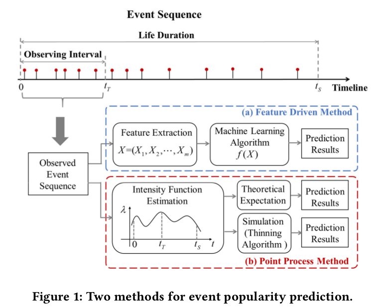

# PreNets - CIKM 2018
### The 27th ACM International Conference on Information and Knowledge Management (CIKM2018), Lingotto, Turin, Italy.
<strong>Title</strong>: Adversarial Training Model Unifying Feature Driven and Point Process Perspectives for Event Popularity Prediction 
<strong>Author</strong>: Qitian Wu, <a href="http://chaoqiyang.com">Chaoqi Yang</a>, Hengrui Zhang, <a href="http://www.cs.sjtu.edu.cn/~gao-xf/">Xiaofeng Gao</a>, Paul Weng and Guihai Chen 

---
<strong>Abstract</strong>: This paper targets a general popularity prediction problem for event sequence, which recently has aroused great attention due to its extensive applications in various domains. Feature driven method and point process method are two basic thinking paradigms to tackle the prediction problem but both of them suffer from respective limitations. In this paper, we pioneeringly propose PreNets unifying two thinking paradigms in an adversarial manner. On one side, the feature driven model, like a ‘critic’, aims to discriminate the predicted popularity from the real one based on a set of temporal features from the sequence. On the other side, the point process model, like an ‘interpreter’, recognizes the dynamic patterns in the sequence to generate a predicted popularity to fool the ‘critic’. Through a Wasserstein learning based two-player game, the training loss of the ‘critic’ would guide the ‘interpreter’ to better exploit the sequence patterns and enhance the prediction, while the
‘interpreter’ would push the ‘critic’ to select the effective early features that can help the discrimination. This mechanism enables the framework to absorb the strengths of both feature driven and point process methods. Empirical results show that PreNets can achieve 21.1% MAPE improvement for Twitter cascade prediction and 6.3% for Amazon review prediction.

<table><tr>
<td></td>
<td></td>
</tr></table>
